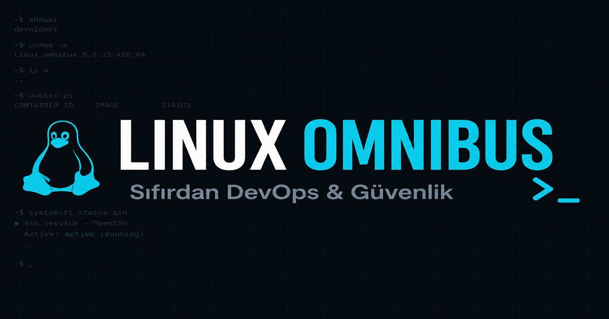

# Linux Omnibus

Türkçe, tarayıcıda çalışan, **sıfırdan job-ready’ye** Linux müfredatı.  
Sunucu yok, `npm install` yok, build yok — statik dosyaları açıyorsun, okuyorsun.

[](#yayınlama-vercel)
[](LICENSE)
[-0B0E14?style=flat-square)](#kullanılan-teknolojiler)

<p align="center">
  
</p>

**Canlı demo:** Vercel + kendi domain’in (subdomain bağlayınca buraya yazılacak).  
Geçici: Vercel’in verdiği `*.vercel.app` URL’si.

---

## Ne işe yarar?

Tek sayfada:

| Modül | Ölçek (yaklaşık) |
|--------|------------------|
| Müfredat | **35 bölüm**, her biri başlangıç / orta / ileri |
| Hedef yollar | **9 kariyer track**’i (DevOps, SRE, SOC, Red/Blue Team, Cloud Ops…) |
| Komut ansiklopedisi | **~570 komut** (TR karşılık + örnek) |
| Kali Arsenal | Katalog + **16 derin araç** modülü |
| Mülakat | **~50+ soru**, track/seviye filtresi |
| Quiz & ilerleme | Ders sonu mini-quiz, okundu işaretleri, JSON dışa/içe aktar |
| Widget’lar | chmod, cron, FHS, CIDR, `docker run` builder |

Amaç: komut ezberi değil; “bu sistem neden böyle davrandı?” diye sorabilen bir ops / güvenlik temeli.

> Güvenlik ve Kali içerikleri yalnızca kendi laboratuvarın veya yazılı izinli ortamlar içindir.

---

## Kurulum (lokal)

**Gereksinim:** modern bir tarayıcı. Node/Python yalnızca isteğe bağlı lokal sunucu için.

```bash
git clone https://github.com/burakkutlu27/LinuxOmnibus.git
cd LinuxOmnibus

# önerilen — PWA / service worker için HTTP gerekir
npx --yes serve .
# veya: python -m http.server 8080
```

Tarayıcıda `http://localhost:3000` (veya seçtiğin port).

`file://` ile de açılır; PWA/offline cache çalışmaz. İlk yüklemede CDN (Tailwind, Font Awesome, Google Fonts) gerekir; service worker sonrası app shell offline okunabilir.

---

## Yayınlama (Vercel)

Bu repo **build’siz statik** site. Ortam değişkeni **yok** (`vercel.json` yalnızca headers / static publish).

### 1) Projeyi bağla

1. [Vercel](https://vercel.com) → **Add New… → Project** → bu GitHub repo’yu import et  
2. Framework Preset: **Other**  
3. Build Command: *boş bırak*  
4. Output Directory: `.` (veya boş — kök `index.html`)  
5. Install Command: *boş*  
6. Deploy

Config: [`vercel.json`](vercel.json)

### 2) Domain bağla (portföy sitenle aynı aile)

Diğer projelerin gibi bir subdomain önerisi:

| Örnek | Ne zaman |
|--------|----------|
| `linux.senin-domain.com` | Kısa, marka odaklı |
| `omnibus.senin-domain.com` | Proje adıyla birebir |
| `learn.senin-domain.com/…` | Path altında (ayrı Vercel project + rewrite gerekir — şimdilik önermiyorum) |

Vercel Project → **Settings → Domains** → subdomain ekle → DNS’te CNAME → `cname.vercel-dns.com` (veya Vercel’in gösterdiği kayıt).

Ana sitenizden link: `https://senin-domain.com` portföyünde “Linux Omnibus” → bu subdomain.

### 3) SEO URL’lerini güncelle

`robots.txt`, `sitemap.xml`, `index.html` (canonical/OG) ve `app.js` içindeki kanonik origin şu an geçici olarak `github.io` değerinde.  
**Canlı subdomain’i yazdığında** hepsini o URL’ye çekeriz (tek seferlik).

---

## Kullanılan teknolojiler

| Katman | Seçim |
|--------|--------|
| UI | HTML + Tailwind CDN + özel CSS değişkenleri (açık/koyu) |
| Mantık | Vanilla JS (`app.js`), içerik düz JS dizileri |
| İkon / font | Font Awesome 6, IBM Plex, Source Serif 4 |
| Offline | `manifest.webmanifest` + service worker (`sw.js`) |
| SEO | `robots.txt`, `sitemap.xml`, OG/Twitter, JSON-LD, `?p=` route |
| Hosting hedefi | Vercel (+ özel domain) |

**Bağımlılık dosyası yok** (`package.json` yok) — bilinçli tercih.

---

## Öne çıkan teknik kararlar

1. **No-build SPA** — Müfredat `window.BIBLE` vb. veri yapılarında; yeni ders = objeye alan eklemek. Öğrenme içeriği toolchain’e kilitlenmesin diye.
2. **`?p=` birincil route, hash yedek** — Eski `#ch15/orta` yer imleri çalışır; sitemap ve canonical indeks için query kullanır.
3. **İstemci tarafı ilerleme** — `localStorage` + JSON export/import; hesap/backend yok.
4. **PWA cache** — App shell + içerik JS + CDN varlıkları; lab / uçak modu okuma.
5. **CDN Tailwind** — Trade-off: sıfır build maliyeti vs. production CSS bundle. Proje karakteri “aç ve oku”; bundler bilerek eklenmedi.
6. **İçerik = kod** — CMS yok; PR ile müfredat review edilebilir.

---

## Repo haritası

```
index.html                 # kabuk, SEO meta, stiller
app.js                     # routing, arama, render, PWA kaydı
content.js / content-more.js
tracks.js / interview.js
encyclopedia*.js
kali-arsenal.js / kali-deep.js
manifest.webmanifest / sw.js
robots.txt / sitemap.xml / og-image.jpg
vercel.json                # Vercel static publish + headers
```

Ders sonu quiz örneği:

```js
quiz: [
  { q: 'Soru?', choices: ['A', 'B', 'C', 'D'], answer: 1, explain: 'Kısa açıklama' }
]
```

`answer` 0-tabanlı indeks. Widget: `widget: 'chmod' | 'cron' | 'fhs' | 'cidr' | 'docker'`.

---

## Lisans

[MIT](LICENSE) — yazılım ve müfredat dosyaları.
